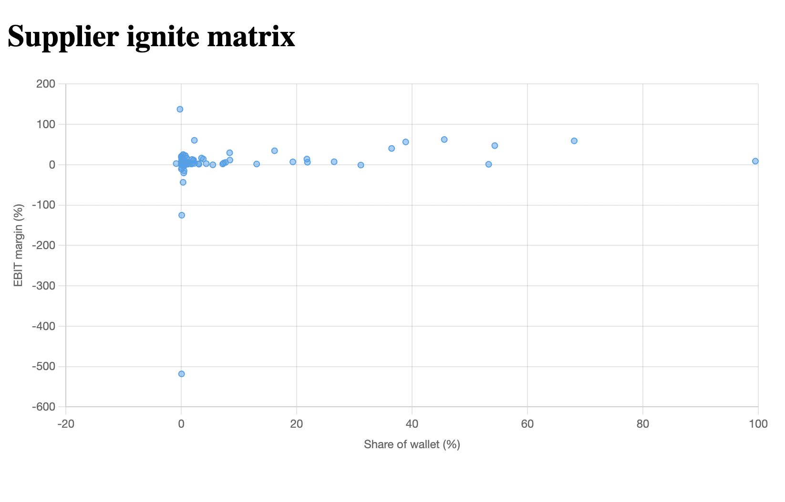

# Bubblegum

## Backend
### Installation
1. Ensure poetry is installed
2. Install dependencies `poetry install`
3. Activate interactive shell `poetry shell`
4. Navigate to the backend folder `cd bubble-backend/bubble_backend`
5. Run the API server `fastapi dev api.py` (or `poetry run fastapi dev api.py` if you omitted the 3rd step)

### Stack
- Python + Django + FastAPI
- Poetry

## Frontend
### Installation
1. Ensure npm is installed
2. Navigate to the frontend folder `cd bubble-frontend`
3. Install dependencies `npm install`
4. Run it `npm run dev`

### Stack
- HTML + typescript
- Parcel module bundler
- Chart.js for the charts

## Demo

## TODOs
- Swap out the scatter plot with a bubble plot.
- Non-linear x-axis to better display the data.
- Understand data. Why rows and columns, duplicate?
  - Y-axis is EBIT margin: share of gross income that will be retained by the company as profit. (sales - cogs - operating expenses) / sales
  - X-axis is share of wallet: share of budget spent on this supplier within its category
  - Scalar is total spend
- Python setup lint on save
